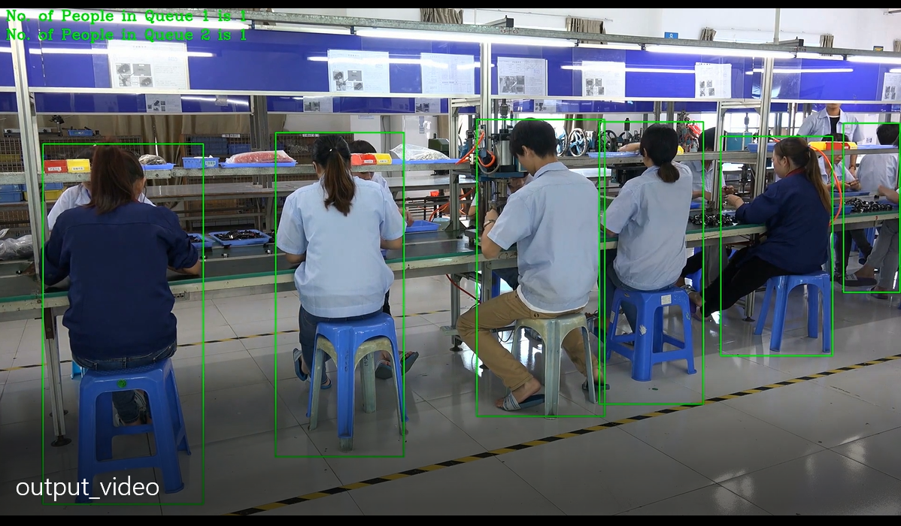
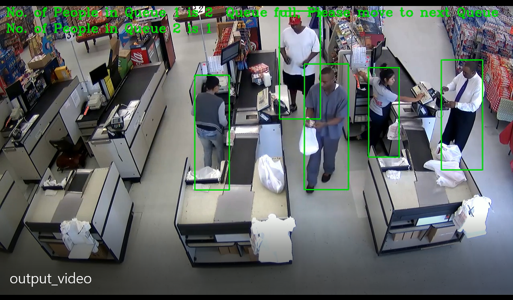
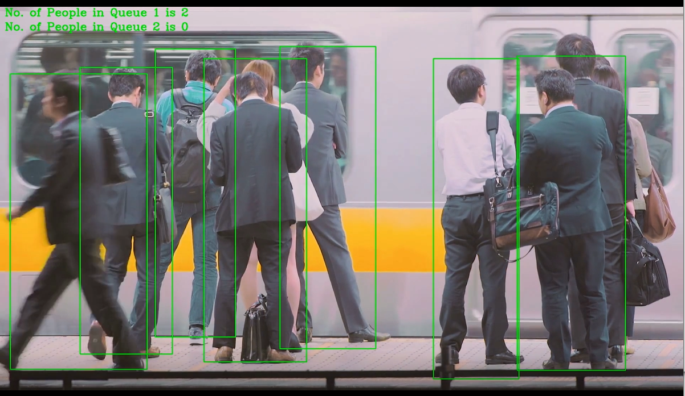

# Smart Queuing System 

Smart Queuing System covers following following features

* Propose a possible hardware solution
* Build out your application and test its performance on the DevCloud using multiple hardware types
* Compare the performance to see which hardware performed best
* Revise your proposal based on the test results

The three scenarios you'll be looking at are:

* Scenario 1: Manufacturing Sector
* Scenario 2: Retail Sector
* Scenario 3: Transportation Sector

**Choose the right hardware proposal**  

**Result**  
Manufacturing  
  
Retail  
  
Transportation  
  